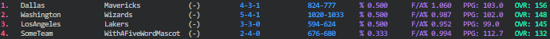
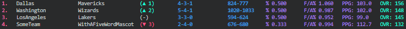

# League Tool

## Overview

Current version: 0.1.0

This is a command-line program written in Rust for seeding teams based on their win percentage and ratio of points scored to points against. Seeding is also provided with interesting statistics, such as seed delta (optional if previous seeding is provided), win-loss ratio, win percentage, points for-points against ratio, and f/a percentage.

## Usage

To get started, install with 

`git clone https://github.com/cj-sz/league-tool`

in your favorite directory and ensure Rust is installed.

Then, use `make help` to view a list of available options or run `cargo build`. The executable will be generated to `target/debug`.

To run the tool, use

`target/debug/league-tool <team file> <game file> <optional: seeding file>`

Your files need to have specific formats (see below). If provided, a seeding file allows the tool to provide more descriptive statistics about changes in your league's seeding from the last time you ran the tool. This file is optional, so omitting it will simply provide a seeding list without any delta statistics.

To see example functionality, run `make ex`. You can also view the files in `examples/` for proper file formatting.

### Team File

Your team file should have teams listed in the format

`<TeamName> <MascotName>`

with each team separated by a newline. To differentiate between the team name and mascot name, separate the two with whitespace. As a consequence if your team or mascot contains two different words, they must be kept together (for example "Los Angeles Lakers" would cause the tool to think your team is "Los" and mascot is "Angeles", so in your team file format this as "LosAngeles Lakers"). For now, teams are displayed in the same fashion in the output.

### Game File

Your game file should have games listed in the following format:

`<Game Number>. <WinningMascot> def. <LosingMascot> <WinPoints>-<LosePoints>`

Don't forget the `.` after the game number and the `-` with no whitespace in between the points! Also, take note: the winning team must be listed before the losing team, and likewise for the respective points. Games should be separated by a newline.

The tool does not yet support tied games.

### Seeding File (Optional)

If providing this, simply copy and paste exactly what is printed to the terminal after running the league tool into a text document and do not make any changes. It then works immediately!

Notice, without a previous seeding file we would get something like this (see `make ex` for details):

But with some previous seeding we get interesting delta statistics like this:

## Roadmap

- Add support for the official [team ranking algorithm](https://www.math.umd.edu/~immortal/MATH401/book/ch_team_ranking.pdf) (this is a long term goal)
- More descriptive statistics, and specific descriptive statistics for a given team or set of teams
- Support ties, overtime statistics, and other interesting stuff
- See the code for other minor TODOs!